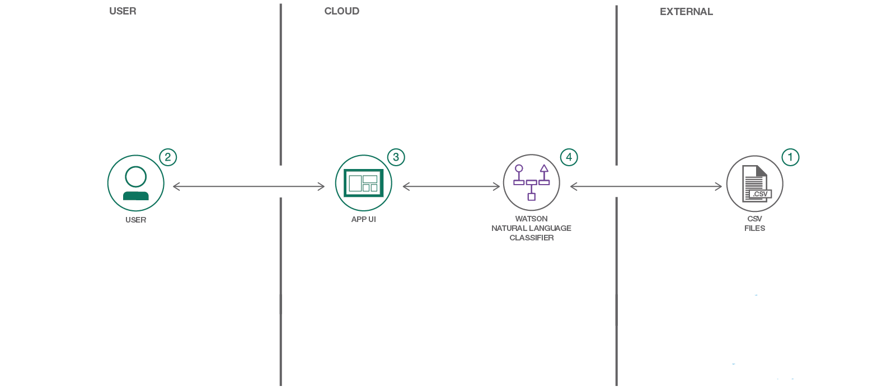
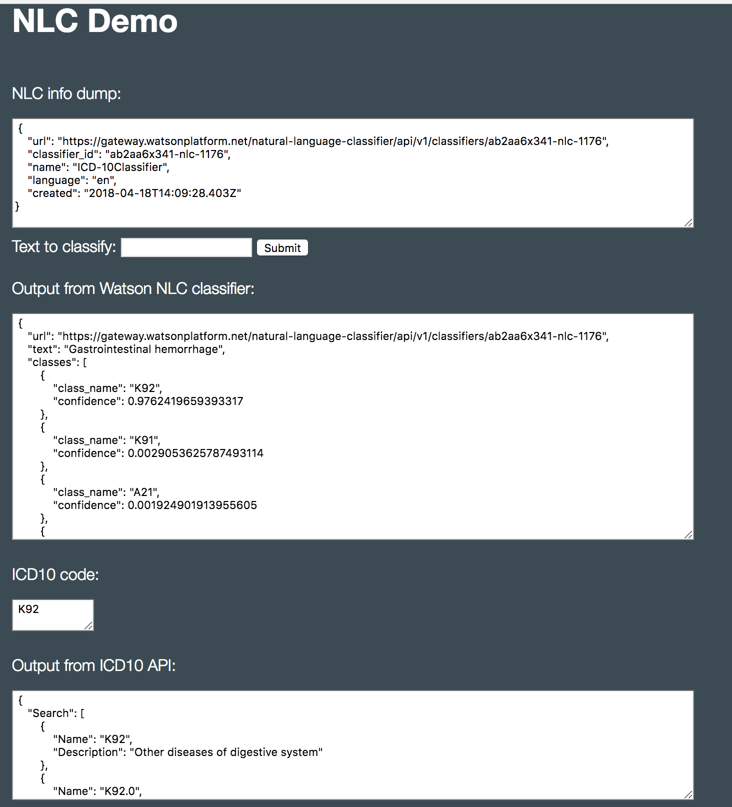

*Read this in other languages: [English](README.md).*

> **免責事項**: このアプリケーションはデモと説明のためだけに使用しているので、法規制関連のレビューは行われていません。医療アプリケーションとして使用されるよう意図されていないため、出力の正確さに関する表現はありません。これは、保証なしで提示するアプリケーションです。

[](https://travis-ci.org/IBM/nlc-icd10-classifier)

# ICD-10コードで医療診断を分類する

このアプリケーションは、IBMのWatson Natural Language Classifier(NLC)を実証するために作成されました。
[ICD-10-GT-AA.csv](data/ICD-10-GT-AA.csv) には、[ICD-10](https://en.wikipedia.org/wiki/ICD-10) エントリのサブセットが含まれています。
ICD-10 は、[疾病及び関連保健問題の国際統計分類](https://ja.wikipedia.org/wiki/%E7%96%BE%E7%97%85%E5%8F%8A%E3%81%B3%E9%96%A2%E9%80%A3%E4%BF%9D%E5%81%A5%E5%95%8F%E9%A1%8C%E3%81%AE%E5%9B%BD%E9%9A%9B%E7%B5%B1%E8%A8%88%E5%88%86%E9%A1%9E) (略称: 国際疾病分類) の10番目の改訂版です。
世界保健機関 (WHO) が死因や疾病の国際的な統計基準として公表している医療分類リストです。
病院や保険会社は、Watson を活用して最も近い ICD-10 コードを反映したタグを付けることによって、時間と費用を節約することができます。

このアプリケーションは、[Flask microframework](http://flask.pocoo.org/) に基づいた Python Web アプリケーションであり、[Ryan Anderson](https://github.com/rustyoldrake/IBM_Watson_NLC_ICD10_Health_Codes) の以前の成果物に基づいています。
[Watson Python SDK](https://github.com/watson-developer-cloud/python-sdk) を使用して分類子を作成し、分類子を整理し、入力テキストを分類します。
また、フリーで利用できる [ICD-10 API](http://icd10api.com/) を利用して、ICD-10 コードを与えて名前と説明を返します。

このコード・パターンをひと通り完了すると、以下の方法がわかるようになります:

* Natural Language Classifier (NLC) サービスのインスタンスを作成し、そのインスタンスを Python アプリケーション内で使用する
* CSV データを使用して NLC モデルをトレーニングする
* Flask を使用して Web アプリをデプロイし、NLC モデルに対してクエリーを実行できるようにする
* NLC トレーニング済みモデルを使用して、疾病や健康問題の分類結果を迅速に取得する

## Flow

1. モデルのトレーニングに使用する CSV ファイルを Natural Language Classifier サービスに送信します。
2. ユーザーが、ローカルまたはクラウド内で実行されているアプリの UI を操作します。
3. アプリケーションから Natural Language Classifier モデルに、分類対象のユーザー入力が送信されます。
4. 分類結果を含む情報が Web アプリに返されます。



## 含まれるコンポーネント

* [Watson Natural Language Classifier](https://www.ibm.com/watson/jp-ja/developercloud/nl-classifier.html) 自然言語の意図を解釈し、関連度合いを信頼度レベル付けして分類する IBM Cloud サービス。

## 利用した技術

* [Artificial Intelligence](https://medium.com/ibm-data-science-experience): 人工知能を分散したソリューション空間に適用して、[破壊的な技術](https://ja.wikipedia.org/wiki/%E7%A0%B4%E5%A3%8A%E7%9A%84%E6%8A%80%E8%A1%93) を提供することができます。
* [Cloud](https://www.ibm.com/developerworks/learn/cloud/): インターネットを介してコンピュータおよび情報技術リソースにアクセスする。
* [Python](https://www.python.org/): Pythonは、より迅速に作業し、システムをより効果的に統合するためのプログラミング言語です。

# ビデオを観る

[](https://www.youtube.com/watch?v=N0eKEZxdwsQ)

## 前提条件

ここでは、ICD-10データセットで分類器を作成します。

1. 本リポジトリ `git clone git@github.com:IBM/nlc-icd10-classifier.git` をクローンし、そのルートディレクトリに `cd` します。


2. `data` フォルダにある `ICD-10-GT-AA.csv` データセットを使用します
    > トレーニング時間を短くおさえるため、ICD-1010分類セット全体のサブセットを使用していることに注意してください。

3. [IBM Cloud の NLC サービス](https://cloud.ibm.com/catalog/services/natural-language-classifier) を作成し、サービス名をメモしておきます。これは後で必要になります。

4. 左の 'Service credentials' メニューからデフォルトのオプションを選択して、サービスの資格情報を作成します。
    

5. 環境変数としてユーザー名とパスワードをエクスポートし、以下のコマンドを使用してデータをロードします。
これには約3時間かかります。

    ```bash
    export USERNAME=<username_from_credentials>
    export PASSWORD=<pasword_from_credentials>
    export FILE=data/ICD-10-GT-AA.csv

    curl -i --user "$USERNAME":"$PASSWORD" -F training_data=@$FILE -F training_metadata="{\"language\":\"en\",\"name\":\"ICD-10Classifier\"}" "https://gateway.watsonplatform.net/natural-language-classifier/api/v1/classifiers"
    ```

6. コマンドを実行して分類器を作成した後、返されるjsonの `classifier_id` に注目してください:

    ```JSON
    {
      "classifier_id" : "ab2aa6x341-nlc-1176",
      "name" : "ICD-10Classifier",
      "language" : "en",
      "created" : "2018-04-18T14:09:28.403Z",
      "url" : "https://gateway.watsonplatform.net/natural-language-classifier/api/v1/classifiers/ab2aa6x341-nlc-1176",
      "status" : "Training",
      "status_description" : "The classifier instance is in its training phase, not yet ready to accept classify requests"
    }
    ```

    そして、その注目した `classifier_id` の値を環境変数としてエクスポートします:

    ```bash
    export CLASSIFIER_ID=<my_classifier_id>
    ```

    これで、分類器のトレーニングのステータスを確認できます:

    ```bash
    curl --user "$USERNAME":"$PASSWORD" "https://gateway.watsonplatform.net/natural-language-classifier/api/v1/classifiers/$CLASSIFIER_ID"
    ```

## 手順

このアプリケーションは、ローカルで実行することも、IBM Cloud上でホストすることもできます。
選択に応じて、以下のどちらかの手順に従ってください。

### ローカルで実行する

1. 本リポジトリをクローンします: `git clone git@github.com:IBM/nlc-icd10-classifier.git`

2. 本プロジェクトのルートディレクトリに `cd` します。

3. (実施は任意です)
    1. 仮想環境を作成する: `virtualenv my-nlc-classifier`
    2. 仮想環境をアクティブにする: `. my-nlc-classifier/bin/activate`


4. `pip install -r requirements.txt` を実行して、アプリケーションの依存するモジュールをインストールします。

5. `env.example` ファイルを `.env` にコピーします。

6. `.env` ファイルに NLC 認証情報を書き込みます:

    ```bash
    # Replace the credentials here with your own.
    # Rename this file to .env before running run.py.

    NATURAL_LANGUAGE_CLASSIFIER_USERNAME=<add_NLC_username>
    NATURAL_LANGUAGE_CLASSIFIER_PASSWORD=<add_NLC_password>
    ```

7. `python welcome.py` を実行します。

8. Web ブラウザで `http://localhost:5000` を開き実行しているアプリにアクセスします。

### IBM Cloud で実行する

1. リポジトリをクローンします: `git clone git@github.com:IBM/nlc-icd10-classifier.git`

2. このプロジェクトのルートディレクトリに `cd` します。

3. NLCサービス名 (`your_nlc_service_name`)、ユニークなアプリケーション名 (`your_app_name`)、ユニークなホスト値 (`your_app_host`) で [`manifest.yml`](manifest.yml) ファイルを更新します。

    ```yaml
    applications:
      - path: .
      memory: 256M
      instances: 1
      domain: mybluemix.net
      name: your_app_name
      host: your_app_host
      disk_quota: 1024M
      services:
      - your_nlc_service_name
      buildpack: python_buildpack
    ```

4. ルートディレクトリで `bluemix app push` を実行します。

> 初めて `bluemix` コマンドを実行する場合には、幾つかの事前設定が必要です。公式の [IBM Cloud CLI](https://cloud.ibm.com/docs/cli/reference/bluemix_cli/get_started.html) ドキュメントを参照してセットアップを実施してください。

5. 実行中のアプリケーションに Web ブラウザでアクセスします: `https://<host-value>.mybluemix.net/`

# サンプル出力

ユーザは、`Text to classify:` ボックスに情報を入力し、Watson NLC 分類器は、信頼スコア (confidence scores) で ICD10 分類を返します。
以下は、入力 `Gastrointestinal hemorrhage (消化器出血)` に対する出力例です:



# リンク
* [Watson NLC API](https://www.ibm.com/watson/developercloud/natural-language-classifier/api/v1/)
* [Watson Python SDK](https://github.com/watson-developer-cloud/python-sdk)
* [IBM Cloud CLI](https://cloud.ibm.com/docs/cli/reference/bluemix_cli/get_started.html)
* [Watson Natural Language Classifier](https://www.ibm.com/watson/jp-ja/developercloud/nl-classifier.html)
* [Ryan Anderson's Original Work](https://github.com/rustyoldrake/IBM_Watson_NLC_ICD10_Health_Codes)
* [ICD-10 API](http://icd10api.com)
* [国際疾病分類 (ICD-10) on Wikipedia](https://ja.wikipedia.org/wiki/%E7%96%BE%E7%97%85%E5%8F%8A%E3%81%B3%E9%96%A2%E9%80%A3%E4%BF%9D%E5%81%A5%E5%95%8F%E9%A1%8C%E3%81%AE%E5%9B%BD%E9%9A%9B%E7%B5%B1%E8%A8%88%E5%88%86%E9%A1%9E)
* [Intro to NLC Tutorial](https://www.youtube.com/watch?v=SUj826ybCdU)

# もっと学ぶ

* **Artificial Intelligence コードパターン**: このコードパターンを気に入りましたか？ [AI コードパターン](https://developer.ibm.com/jp/technologies/artificial-intelligence/) から関連パターンを参照してください。
* **AI and Data コードパターン・プレイリスト**: コードパターンに関係するビデオ全ての [プレイリスト](https://www.youtube.com/playlist?list=PLzUbsvIyrNfknNewObx5N7uGZ5FKH0Fde) です。
* **With Watson**: [With Watson](https://www.ibm.com/watson/jp-ja/with-watson/) プログラム は、自社のアプリケーションに Watson テクノロジーを有効的に組み込んでいる開発者や企業に、ブランディング、マーケティング、テクニカルに関するリソースを提供するプログラムです。

# ライセンス

[Apache 2.0](LICENSE)
