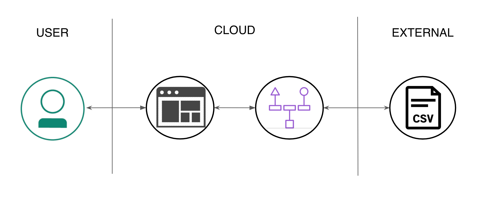

> **DISCLAIMER**: This application is used for demonstrative and illustrative purposes only and does not constitute an offering that has gone through regulatory review. It is not intended to serve as a medical application. There is no representation as to the accuracy of the output of this application and it is presented without warranty.

# Classify medical diagnosis with ICD-10 code

This application was built to demonstrate IBM's Watson Natural Language Classifier (NLC). The data set we will be using, [ICD-10-GT-AA.csv](data/ICD-10-GT-AA.csv), contains a subset of [ICD-10](https://en.wikipedia.org/wiki/ICD-10) entries. ICD-10 is the 10th revision of the International Statistical Classification of Diseases and Related Health Problems. In short, it is a medical classification list by the World Health Organization (WHO) that contains codes for: diseases, signs and symptoms, abnormal findings, complaints, social circumstances, and external causes of injury or diseases. Hospitals and insurance companies alike could save time and money by levearging Watson to properly tag the most accurate ICD-10 codes.

This application is a Python web application based on the [Flask microframework](http://flask.pocoo.org/), and based on earlier work done by [Ryan Anderson](https://github.com/rustyoldrake/IBM_Watson_NLC_ICD10_Health_Codes). It uses the [Watson Python SDK](https://github.com/watson-developer-cloud/python-sdk) to create the classifier, list classifiers, and classify the input text. We also make use of the freely available [ICD-10 API](http://icd10api.com/) which, given an ICD-10 code, returns a name and description.

## Architecture



## Setup the classifier

Here we create the classifier with our ICD-10 dataset.

1. Download the [ICD-10 dataset](https://raw.githubusercontent.com/stevemart/nlc-icd10-demo/master/data/ICD-10-GT-AA.csv) by right clicking the link and seletcting _Save As_.
1. Create an [NLC service in IBM Cloud](https://console.bluemix.net/catalog/services/natural-language-classifier), make a note of the service name used in the catalog, we'll need this later.
1. Create service credentials by using the menu on the left and selecting the default options.
1. Upload the data using the command below. Be sure to substitute the username and password. This will take around 3 hours.

```bash
curl -i --user "$username":"$password" -F training_data=@ICD-10-GT-AA.csv -F training_metadata="{\"language\":\"en\",\"name\":\"ICD-10Classifier\"}" "https://gateway.watsonplatform.net/natural-language-classifier/api/v1/classifiers"
````

## Running the application

This application can be run locally or hosted on IBM Cloud, follow the steps below depending on your deployment choice

### Run locally

1. Clone this project: `git clone git@github.com:IBM/nlc-icd10-demo.git`
1. `cd` into this project's root directory
1. (Optionally) create a virtual environment: `virtualenv my-nlc-demo`
    1. Activate the virtual environment: `./my-nlc-demo/bin/activate`
1. Run `pip install -r requirements.txt` to install the app's dependencies
1. Update the [welcome.py](welcome.py) with your NLC credentials
1. Run `python welcome.py`
1. Access the running app in a browser at `http://localhost:5000`

### Run on IBM Cloud

1. Clone this project: `git clone git@github.com:IBM/nlc-icd10-demo.git`
1. `cd` into this project's root directory
1. Update [`manifest.yml`](manifest.yml) with the NLC service name (`your_nlc_service_name`), a unique application name (`your_app_name`) and unique host value (`your_app_host`)

    ```
    applications:
      - path: .
      memory: 256M
      instances: 1
      domain: mybluemix.net
      name: your_app_name
      host: your_app_host
      disk_quota: 1024M
      services:
      - your_nlc_service_name
      buildpack: python_buildpack
    ```

1. Run `bluemix app push` from the root directory
1. Access the running app by going to: `https://<host-value>.mybluemix.net/`

> If you've never run the `bluemix` command before there is some configuration required, refer to the official [IBM Cloud CLI](https://console.bluemix.net/docs/cli/reference/bluemix_cli/get_started.html) docs to get this set up.

# Links
* [Watson NLC API](https://www.ibm.com/watson/developercloud/natural-language-classifier/api/v1/)
* [Watson Python SDK](https://github.com/watson-developer-cloud/python-sdk)
* [IBM Cloud CLI](https://console.bluemix.net/docs/cli/reference/bluemix_cli/get_started.html)
* [Watson Natural Language Classifier](https://www.ibm.com/watson/services/natural-language-classifier/)
* [Ryan Anderson's Original Work](https://github.com/rustyoldrake/IBM_Watson_NLC_ICD10_Health_Codes)
* [ICD-10 API](http://icd10api.com)
* [ICD-10 on Wikipedia](https://en.wikipedia.org/wiki/ICD-10)
* [Intro to NLC Tutorial](https://www.youtube.com/watch?v=SUj826ybCdU)

# License

[Apache 2.0](LICENSE)
