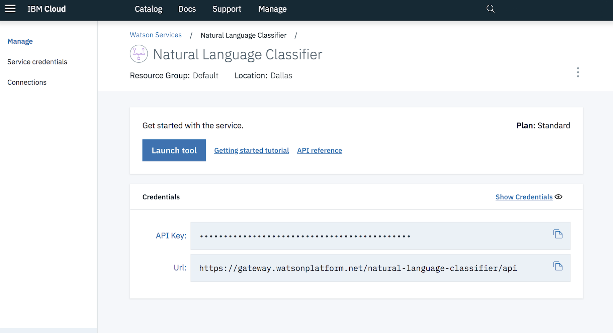

[](https://travis-ci.org/IBM/nlc-icd10-classifier)

*Read this in other languages: [日本語](README-ja.md).*

> **DISCLAIMER**: This application is used for demonstrative and illustrative purposes only and does not constitute an offering that has gone through regulatory review. It is not intended to serve as a medical application. There is no representation as to the accuracy of the output of this application and it is presented without warranty.

# Classify medical diagnosis with ICD-10 code

This application was built to demonstrate IBM's Watson Natural Language Classifier (NLC). The data set we will be using, [ICD-10-GT-AA.csv](data/ICD-10-GT-AA.csv), contains a subset of [ICD-10](https://en.wikipedia.org/wiki/ICD-10) entries. ICD-10 is the 10th revision of the International Statistical Classification of Diseases and Related Health Problems. In short, it is a medical classification list by the World Health Organization (WHO) that contains codes for: diseases, signs and symptoms, abnormal findings, complaints, social circumstances, and external causes of injury or diseases. Hospitals and insurance companies alike could save time and money by leveraging Watson to properly tag the most accurate ICD-10 codes.

This application is a Python web application based on the [Flask microframework](http://flask.pocoo.org/), and based on earlier work done by [Ryan Anderson](https://github.com/rustyoldrake/IBM_Watson_NLC_ICD10_Health_Codes). It uses the [Watson Python SDK](https://github.com/watson-developer-cloud/python-sdk) to create the classifier, list classifiers, and classify the input text. We also make use of the freely available [ICD-10 API](http://icd10api.com/) which, given an ICD-10 code, returns a name and description.

When the reader has completed this pattern, they will understand how to:

* Create a Natural Language Classifier (NLC) service and use it in a Python application.
* Train a NLC model using csv data.
* Deploy a web app with Flask to allow the NLC model to be queried.
* Quickly get a classification of a disease or health issue using the Natural Language Classifier trained model.


## Flow

1. CSV files are sent to the Natural Language Classifier service to train the model.
2. The user interacts with the web app UI running either locally or in the cloud.
3. The application sends the user's input to the Natural Language Classifier model to be classified.
4. The information containing the classification is returned to the web app.

## Included Components

* [Watson Natural Language Classifier](https://www.ibm.com/watson/services/natural-language-classifier/): An IBM Cloud service to interpret and classify natural language with confidence.

## Featured Technologies

* [Artificial Intelligence](https://medium.com/ibm-data-science-experience): Artificial intelligence can be applied to disparate solution spaces to deliver disruptive technologies.
* [Cloud](https://developer.ibm.com/depmodels/cloud/): Accessing computer and information technology resources through the Internet.
* [Python](https://www.python.org/): Python is a programming language that lets you work more quickly and integrate your systems more effectively.

# Watch the Video

[](https://www.youtube.com/watch?v=N0eKEZxdwsQ)

# Steps

1. [Clone the repo](#1-clone-the-repo)
2. [Create IBM Cloud services](#2-create-ibm-cloud-services)

Either [Run locally](#3-run-locally) or [Deploy on IBM Cloud](#4-deploy-on-ibm-cloud)

3. [Run locally](#3-run-locally)  
   3a. [Create the classifier](#3a-create-the-classifier)  
   3b. [Run the application](#3b-run-the-application)  
4. [Deploy on IBM Cloud](#4-deploy-on-ibm-cloud)

## 1. Clone the repo

```bash
git clone git@github.com:IBM/nlc-icd10-classifier.git
cd nlc-icd10-classifier
```

## 2. Create IBM Cloud services

Create the following service:

* [Natural Language Classifier](https://console.bluemix.net/catalog/services/natural-language-classifier)

> Note: The NLC service only offers a `Standard` plan, which allows:
```
1 Natural Language Classifier free per month.
1000 API calls free per month
4 Training Events free per month
```
> After that, there are charges for the use of the service when using a paid account.


## 3. Run locally

### 3a. Create the classifier

* Export the username and password as environment variables and then load the data using the command below. If you have an API key, use `apikey` for the username and the API key for the password. This will take around 4.5 hours.

```bash
export USERNAME=<username_from_credentials>
export PASSWORD=<pasword_from_credentials>
export FILE=data/ICD-10-GT-AA.csv

curl -i --user "$USERNAME":"$PASSWORD" -F training_data=@$FILE -F training_metadata="{\"language\":\"en\",\"name\":\"ICD-10Classifier\"}" "https://gateway.watsonplatform.net/natural-language-classifier/api/v1/classifiers"
```

* After running the command to create the classifier, note the `classifier_id` in the json that is returned:

```JSON
{
    "classifier_id" : "ab2aa6x341-nlc-1176",
    "name" : "ICD-10Classifier",
    "language" : "en",
    "created" : "2018-04-18T14:09:28.403Z",
    "url" : "https://gateway.watsonplatform.net/natural-language-classifier/api/v1/classifiers/ab2aa6x341-nlc-1176",
    "status" : "Training",
    "status_description" : "The classifier instance is in its training phase, not yet ready to accept classify requests"
}
```

and export that as an environment variable:

```bash
export CLASSIFIER_ID=<my_classifier_id>
```

Now you can check the status for training your classifier:

```bash
curl --user "$USERNAME":"$PASSWORD" "https://gateway.watsonplatform.net/natural-language-classifier/api/v1/classifiers/$CLASSIFIER_ID"
```

> Note that this is a subset of the entire ICD-10 classification set, which allows faster training time

* When the instance is created you will see a screen where you can copy the service credentials. Copy the API key for later use.

> NLC service instances created after 10/30/18 will have an API key, instances from before this date will provide userid / password credentials.



### 3b. Run the application

* The general recommendation for Python development is to use a virtual environment [(venv)](https://docs.python.org/3/tutorial/venv.html). To install and initialize a virtual environment, use the `venv` module on Python 3 (you install the virtualenv library for Python 2.7):


Create the virtual environment using Python. Use one of the two commands depending on your Python version.
> Note: it may be named python3 on your system.

```bash
python -m venv mytestenv       # Python 3.X
virtualenv mytestenv           # Python 2.X
```

Now source the virtual environment. Use one of the two commands depending on your OS.

```bash
source mytestenv/bin/activate  # Mac or Linux
./mytestenv/Scripts/activate   # Windows PowerShell
```
> **TIP** :bulb: To terminate the virtual environment use the `deactivate` command.

* Go to the cloned repo directory:

```bash
cd nlc-icd10-classifier
```

* Install the Python requirements for this code pattern:

```bash
pip install -r requirements.txt
```


* Rename the `env.example` file to `.env`

```bash
mv env.example .env
```

* Update the `.env` file  with the NLC credentials for either username/password or API key

```bash
# Replace the credentials here with your own using either USERNAME/PASSWORD or IAM_APIKEY
# Comment out the unset environment variables
# Rename this file to .env before running welcome.py.

#NATURAL_LANGUAGE_CLASSIFIER_USERNAME=<add_NLC_username>
#NATURAL_LANGUAGE_CLASSIFIER_PASSWORD=<add_NLC_password>

NATURAL_LANGUAGE_CLASSIFIER_IAM_APIKEY=<add_NLC_iam_apikey>
```

* Run the app

```bash
python welcome.py
```

* Access the running app in a browser at `http://localhost:5000`

## 4. Deploy on IBM Cloud

>Note: If you've never run the `bluemix` command before there is some configuration required, refer to the official [IBM Cloud CLI](https://cloud.ibm.com/docs/cli/reference/bluemix_cli/get_started.html) docs to get this set up.

* Update [`manifest.yml`](manifest.yml) with the NLC service name (`your_nlc_service_name`), a unique application name (`your_app_name`) and unique host value (`your_app_host`)


```yaml
applications:
    - path: .
    memory: 256M
    instances: 1
    domain: mybluemix.net
    name: <your_app_name>
    host: <your_app_host>
    disk_quota: 1024M
    services:
    - <your_nlc_service_name>
    buildpack: python_buildpack
```

* After logging in to the IBM Cloud CLI, if you have a Natural Language Classifier as a resource group service (it will have an API key for the credential), create a Cloud Foundry service alias. Otherwise, skip to the next step.

```bash
ibmcloud target --cf
ibmcloud resource service-alias-create your_nlc_service_name --instance-name your_nlc_service_name
```

* Deploy the application as a Cloud Foundry runtime:

```bash
ibmcloud app push
```

* Access the running app by going to: `https://<host-value>.mybluemix.net/`

# Sample Output

The user inputs information into the `Text to classify:` box and the Watson NLC classifier will return ICD10 classifications with confidence scores.
Here is the output for the input `Gastrointestinal hemorrhage`:


# Links
* [Watson NLC API](https://cloud.ibm.com/apidocs/natural-language-classifier)
* [Watson Python SDK](https://github.com/watson-developer-cloud/python-sdk)
* [IBM Cloud CLI](https://cloud.ibm.com/docs/cli/index.html#overview)
* [Watson Natural Language Classifier](https://www.ibm.com/watson/services/natural-language-classifier/)
* [Ryan Anderson's Original Work](https://github.com/rustyoldrake/IBM_Watson_NLC_ICD10_Health_Codes)
* [ICD-10 API](http://icd10api.com)
* [ICD-10 on Wikipedia](https://en.wikipedia.org/wiki/ICD-10)
* [Intro to NLC Tutorial](https://www.youtube.com/watch?v=SUj826ybCdU)

# Learn more

* **Artificial Intelligence Code Patterns**: Enjoyed this Code Pattern? Check out our other [AI Code Patterns](https://developer.ibm.com/technologies/artificial-intelligence/).
* **AI and Data Code Pattern Playlist**: Bookmark our [playlist](https://www.youtube.com/playlist?list=PLzUbsvIyrNfknNewObx5N7uGZ5FKH0Fde) with all of our Code Pattern videos
* **With Watson**: Want to take your Watson app to the next level? Looking to utilize Watson Brand assets? [Join the With Watson program](https://www.ibm.com/watson/with-watson/) to leverage exclusive brand, marketing, and tech resources to amplify and accelerate your Watson embedded commercial solution.

# License

This code pattern is licensed under the Apache Software License, Version 2.  Separate third party code objects invoked within this code pattern are licensed by their respective providers pursuant to their own separate licenses. Contributions are subject to the [Developer Certificate of Origin, Version 1.1 (DCO)](https://developercertificate.org/) and the [Apache Software License, Version 2](https://www.apache.org/licenses/LICENSE-2.0.txt).

[Apache Software License (ASL) FAQ](https://www.apache.org/foundation/license-faq.html#WhatDoesItMEAN)
