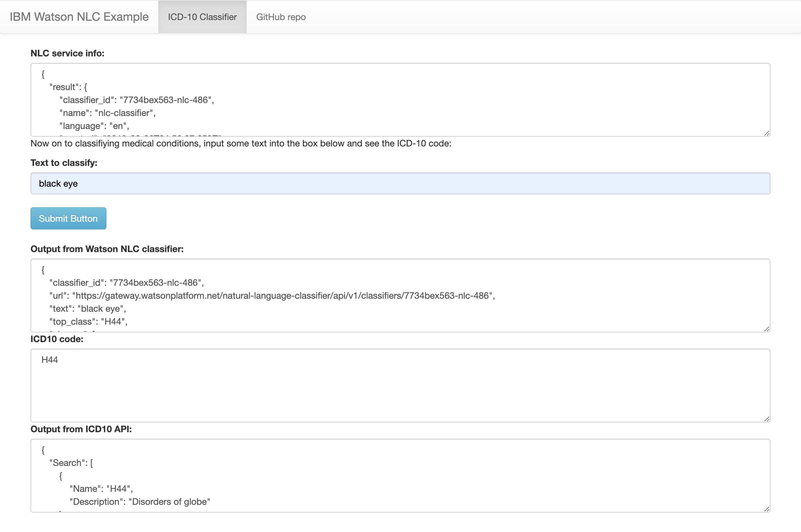

[](https://travis-ci.org/IBM/nlc-icd10-classifier)

> **DISCLAIMER**: This application is used for demonstrative and illustrative purposes only and does not constitute an offering that has gone through regulatory review. It is not intended to serve as a medical application. There is no representation as to the accuracy of the output of this application and it is presented without warranty.

# Classify medical diagnosis with ICD-10 code

This application was built to demonstrate IBM's Watson Natural Language Classifier (NLC). The data set we will be using, [ICD-10-GT-AA.csv](data/ICD-10-GT-AA.csv), contains a subset of [ICD-10](https://en.wikipedia.org/wiki/ICD-10) entries. ICD-10 is the 10th revision of the International Statistical Classification of Diseases and Related Health Problems. In short, it is a medical classification list by the World Health Organization (WHO) that contains codes for: diseases, signs and symptoms, abnormal findings, complaints, social circumstances, and external causes of injury or diseases. Hospitals and insurance companies alike could save time and money by leveraging Watson to properly tag the most accurate ICD-10 codes.

This application is a Python web application based on the [Flask microframework](http://flask.pocoo.org/), and based on earlier work done by [Ryan Anderson](https://github.com/rustyoldrake/IBM_Watson_NLC_ICD10_Health_Codes). It uses the [Watson Python SDK](https://github.com/watson-developer-cloud/python-sdk) to create the classifier, list classifiers, and classify the input text. We also make use of the freely available [ICD-10 API](http://icd10api.com/) which, given an ICD-10 code, returns a name and description.

When the reader has completed this pattern, they will understand how to:

* Create a Natural Language Classifier (NLC) service and use it in a Python application.
* Train a NLC model using csv data.
* Deploy a web app with Flask to allow the NLC model to be queried.
* Quickly get a classification of a disease or health issue using the Natural Language Classifier trained model.

## Flow


1. CSV files are sent to the Natural Language Classifier service to train the model.
1. The user interacts with the web app UI running either locally or in the cloud.
1. The application sends the user's input to the Natural Language Classifier model to be classified.
1. The information containing the classification is returned to the web app.

## Included Components

* [Watson Studio](https://www.ibm.com/cloud/watson-studio): Analyze data using RStudio, Jupyter, and Python in a configured, collaborative environment that includes IBM value-adds, such as managed Spark.
* [Watson Natural Language Classifier](https://www.ibm.com/watson/services/natural-language-classifier/): An IBM Cloud service to interpret and classify natural language with confidence.
* [Python](https://www.python.org/): Python is a programming language that lets you work more quickly and integrate your systems more effectively.

## Watch the Video

[](https://www.youtube.com/watch?v=N0eKEZxdwsQ)

## Steps

1. [Clone the repo](#1-clone-the-repo)
1. [Create IBM Cloud services](#2-create-ibm-cloud-services)
1. [Create a Watson Studio project](#3-create-a-watson-studio-project)
1. [Train the NLC model](#4-train-the-nlc-model)
1. [Run the application](#5-run-the-application)

### 1. Clone the repo

Clone the `nlc-icd10-classifier` repo locally. In a terminal, run:

```bash
git clone https://github.com/IBM/nlc-icd10-classifier
cd nlc-icd10-classifier
```

### 2. Create IBM Cloud services

Create the following service:

* [Natural Language Classifier](https://cloud.ibm.com/catalog/services/natural-language-classifier)

### 3. Create a Watson Studio project

* Log into IBM's [Watson Studio](https://dataplatform.cloud.ibm.com). Once in, you'll land on the dashboard.

* Create a new project by clicking `+ New project` and choosing `Data Science`:

  

* Enter a name for the project name and click `Create`.

* **NOTE**: By creating a project in Watson Studio a free tier `Object Storage` service and `Watson Machine Learning` service will be created in your IBM Cloud account. Select the `Free` storage type to avoid fees.

  

* Upon a successful project creation, you are taken to a dashboard view of your project. Take note of the `Assets` and `Settings` tabs, we'll be using them to associate our project with any external assets (datasets and notebooks) and any IBM cloud services.

  

### 4. Train the NLC model

The data used in this example is part of the ICD-10 data set and a cleaned version we'll use is available in the repo under [data/ICD-10-GT-AA.csv](data/ICD-10-GT-AA.csv). We'll now train an NLC model using this data.

* From the new project `Overview` panel, click `+ Add to project` on the top right and choose the `Natural Language Classifier` asset type.

  

* A new instance of the NLC tool will launch.

  

* Add the data to your project by clicking the `Browse` button in the right-hand `Upload to project` section and browsing to the cloned repo. Choose the [`data/ICD-10-GT-AA.csv`](`data/Email-trainingdata-20k.csv`) file.

* Select the `ICD-10-GT-AA.csv` file you just uploaded and choose `Add to model`.

  

* Click the `Train model` button to begin training. The model will take around an hour to train.

* To check the status of the model, and access it after it trains, go to your project in the `Assets` tab of the `Models` section. The model will show up when it is ready. Double click to see the `Overview` tab.

  

* The first line of the `Overview` tab contains the `Model ID`, remember this value as we'll need it in the next step.

### 5. Run the application

Follow the steps below for deploying the application:

* [Run on IBM Cloud](#run-on-ibm-cloud)

  **OR**

* [Run locally](#run-locally)

#### Run on IBM Cloud

* Press the `Deploy to IBM Cloud` button below.

<p align="center">
    <a href="https://cloud.ibm.com/devops/setup/deploy?repository=https://github.com/IBM/nlc-icd10-classifier.git">
    
    </a>
</p>

* From the IBM Cloud deployment page click the `Deploy` button.

* From the *Toolchains* menu, click the *Delivery Pipeline* to watch while the app is deployed. Once deployed, the app can be viewed by clicking *View app*.

* The app and service can be viewed in the [IBM Cloud dashboard](https://cloud.ibm.com/resources). The app will be named `nlc-icd10-classifier`, with a unique suffix.

* We now need to add a few environment variables to the application's runtime so the right classifier service and model are used. Click on the application from the dashboard to view its settings.

* Once viewing the application, click the `Runtime` option on the menu and navigate to the `Environment Variables` section.

* Update the `CLASSIFIER_ID`, and `NATURAL_LANGUAGE_CLASSIFIER_APIKEY` variables with your `Model ID` from [Step 4](#4-train-the-nlc-model)  and NLC API key from [Step 2](#2-create-ibm-cloud-services). Click `Save`.

  

* After saving the environment variables, the app will restart. After the app restarts you can access it by clicking the *Visit App URL* button.

#### Run locally

The general recommendation for Python development is to use a virtual environment [(venv)](https://docs.python.org/3/tutorial/venv.html). To install and initialize a virtual environment, use the `venv` module on Python 3 (you install the virtualenv library for Python 2.7):

* Create the virtual environment using Python. Use one of the two commands depending on your Python version.

  > **Note**: it may be named python3 on your system.

  ```bash
  python -m venv mytestenv       # Python 3.X
  virtualenv mytestenv           # Python 2.X
  ```

* Now source the virtual environment. Use one of the two commands depending on your OS.

  ```bash
  source mytestenv/bin/activate  # Mac or Linux
  ./mytestenv/Scripts/activate   # Windows PowerShell
  ```

  > **TIP** :bulb: To terminate the virtual environment use the `deactivate` command.

* Rename the [`env.example`](env.example) file to `.env`

  ```bash
  mv env.example .env
  ```

* Update the `.env` file  with the NLC credentials for either username/password or API key

  ```bash
  # Replace the credentials here with your own using either USERNAME/PASSWORD or IAM_APIKEY
  # Comment out the unset environment variables
  # Rename this file to .env before running app.py.

  CLASSIFIER_ID=<add_nlc_classifier_id>
  NATURAL_LANGUAGE_CLASSIFIER_APIKEY=<add_nlc_apikey>
  ```

* Install the app dependencies by running:

  ```bash
  pip install -r requirements.txt
  ```

* Start the app by running

  ```bash
  python app.py
  ```

* Open a browser and point to [`localhost:5000`](http://localhost:5000).

## Sample Output

The user inputs information into the *Text to classify:* text box and the Watson NLC classifier will return ICD10 classifications with confidence scores.

> Classification of *Gastrointestinal hemorrhage*:
> 

## Links

* [Watson NLC API](https://cloud.ibm.com/apidocs/natural-language-classifier)
* [Watson Python SDK](https://github.com/watson-developer-cloud/python-sdk)
* [Ryan Anderson's Original Work](https://github.com/rustyoldrake/IBM_Watson_NLC_ICD10_Health_Codes)
* [ICD-10 API](http://icd10api.com)
* [ICD-10 on Wikipedia](https://en.wikipedia.org/wiki/ICD-10)
* [Intro to NLC Tutorial](https://www.youtube.com/watch?v=SUj826ybCdU)

## Learn more

* **Artificial Intelligence Code Patterns**: Enjoyed this Code Pattern? Check out our other [AI Code Patterns](https://developer.ibm.com/technologies/artificial-intelligence/).
* **AI and Data Code Pattern Playlist**: Bookmark our [playlist](https://www.youtube.com/playlist?list=PLzUbsvIyrNfknNewObx5N7uGZ5FKH0Fde) with all of our Code Pattern videos

## License

This code pattern is licensed under the Apache Software License, Version 2.  Separate third party code objects invoked within this code pattern are licensed by their respective providers pursuant to their own separate licenses. Contributions are subject to the [Developer Certificate of Origin, Version 1.1 (DCO)](https://developercertificate.org/) and the [Apache Software License, Version 2](https://www.apache.org/licenses/LICENSE-2.0.txt).

[Apache Software License (ASL) FAQ](https://www.apache.org/foundation/license-faq.html#WhatDoesItMEAN)
